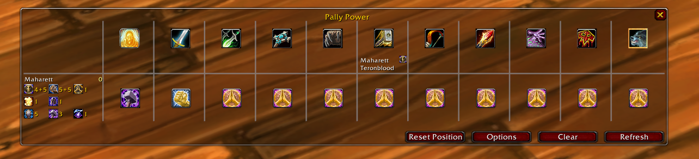
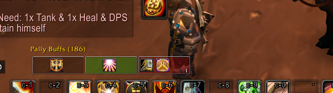

# PallyPower

Paladin blessing, aura, and seal management addon for WoW 1.12.1. Coordinates assignments across multiple Paladins in a raid, tracks buff status per class, and provides one-click Greater/regular blessing casting.

## Screenshots

*Main assignment UI*

*BuffBar horizontal layout with hidden default Aura frame*

## Installation

Download the zip file and rename to PallyPower.

## Usage

Left-click a buff bar button to cast a Greater Blessing. Right-click to cast a normal (5 min) blessing. If individual blessings are assigned, right-click applies those instead.

## Slash Commands

| Command | Description |
|---------|-------------|
| `/pp` or `/pallypower` | Toggle the main assignment UI frame |
| `/pp report` | Print current blessing/aura assignments to raid or party chat |
| `/pp buff` or `/pp autobuff` | Auto-buff all assigned blessings on nearby players |
| `/pp lock` | Toggle locking/unlocking frame positions |
| `/pp debug` | Toggle debug mode (prints diagnostic info to chat) |

## Features

- Assign/clear raid icon when player is marked as tank (requires Raid Leader/Assist or party leader)
- Assign seals for each paladin -- useful for boss fights
- Greater Blessings not allowed on pets if pets and Warriors have different blessings assigned
- If Warriors and pets have the same assignment, mark both as blessed when using Greater Blessings
- Update tank assignment in pfUI (if available)
- Mark a player as a tank (and sync) in the assignment grid (middle mouse button click on player name below the class icon)
- When a paladin leaves the party, the assignment grid adjusts automatically
- Optional pfUI HD Icons (option in settings; defaults to regular icons)
- Line-of-sight checking via UnitXP_SP3 (if available) and mana check before cast
- Save assignment presets ("All Salvation", "All Kings", etc.) including auras
- `/pp report` displays full class/assignment list and aura
- Hide Blizzard aura frame option
- Switch between horizontal or vertical layout for the BuffBar
- Allow others to change your blessings without being Party Leader / Raid Assistant
- Support for individual blessings
- Support for auras
- Righteous Fury on the buff bar
- Individual blessings require a global blessing; global and individual cannot be the same
- Change aura and blessing assignment directly via the BuffBar
- Play sound when blessings expire
- Toggle between regular blessings and Greater Blessings
- Shows the buff frame when solo
- Pet support in the buff table
- Show max rank of each blessing per paladin + talent bonuses
- Correct vanilla 1.12.1 blessing durations (Greater Blessing 15 min, regular Blessing 5 min)
- Spanish localization by Nuevemasnueve

## Notes

- Hunter pets and Warriors share the same class ID, so Greater Blessings affect both (not a bug).

## Changelog

- 08.09.26 - Fixed blessing durations always using the longer Turtle WoW values (30/10 min) instead of the correct vanilla 1.12.1 values (15/5 min).
